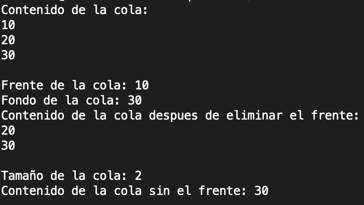

# Queue

Este proyecto es una implementación simple de una **cola (queue) FIFO** en Python. Fue desarrollado como parte de la materia estructura de datos.

La implementación tiene el objetivo de ser clara, legible y funcional, enfocándose en lo esencial de una estructura tipo cola.
---
### Ejemplo de uso


Principales características:

- Añadir y extraer elementos en tiempo O(1).
- Manejo de casos de colas vacías con excepciones o valores por defecto.
- Compatible con tipado genérico y fácil de integrar.
- Totalmente testeada, con cobertura de pruebas y ejemplos de uso.
---

## Uso

Para MacOS y Linux:

```bash
./test
```

Para Windows:
```bash
Cola.exe
```

---

## Licencia

Este proyecto se distribuye bajo la [licencia MIT](LICENSE). Puedes usarlo libremente, adaptarlo, y distribuirlo según los términos de la misma.

---